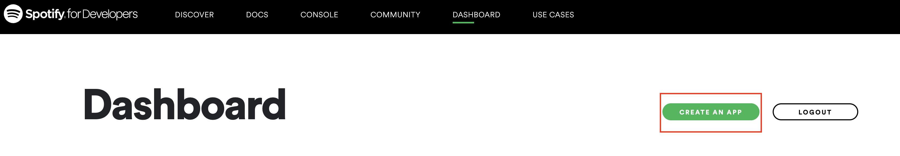
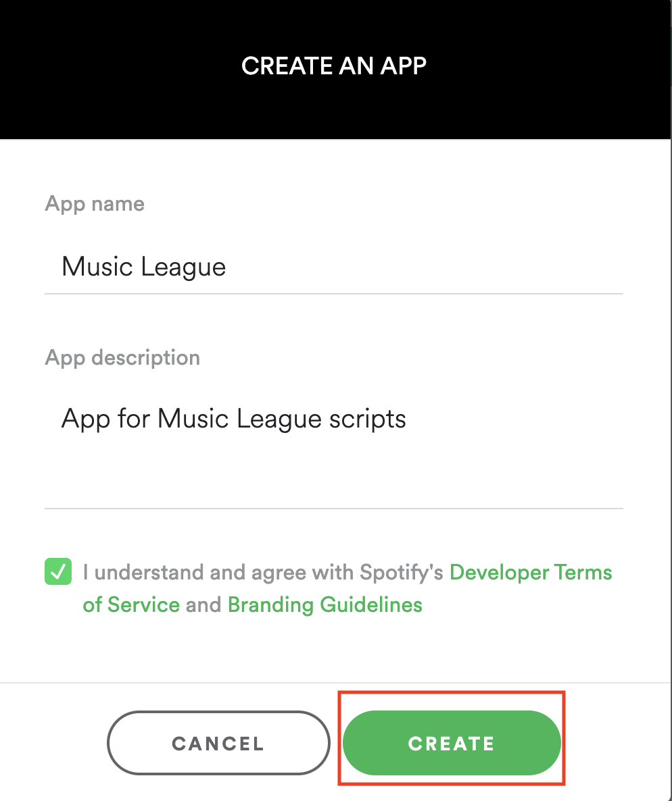
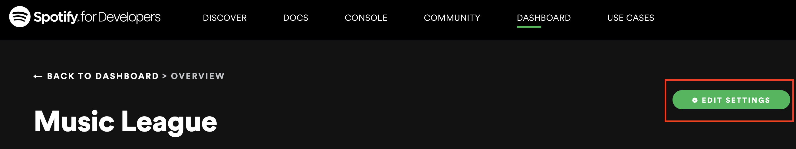
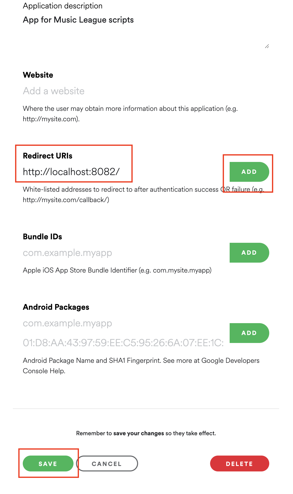
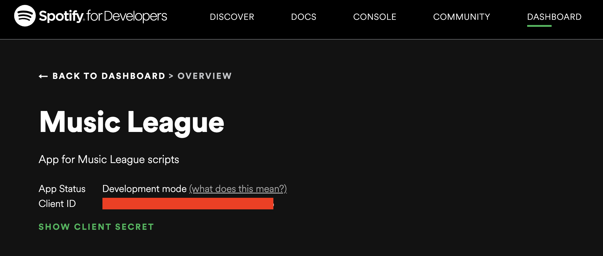
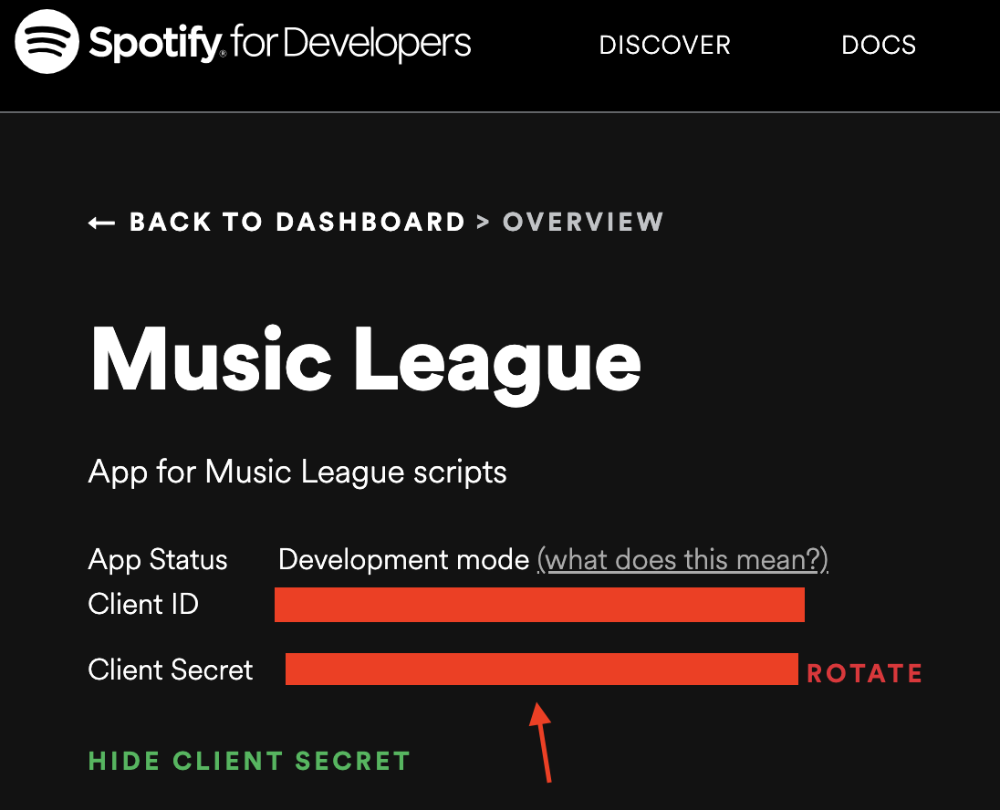

# all-caps

Script used to print songs that are all caps from your spotify liked songs

## How to run locally

#### Install requirements
`pip install -r requirements.txt`

#### Create spotify app
Go to [Spotify Developer Dashboard](https://developer.spotify.com/dashboard/) and sign in

#### Click `CREATE AN APP`

#### Enter app details

#### Click `EDIT SETTINGS`

#### 994a49b2cf7b49e6a577548f8b494dffEnter `http://localhost:8082/` in the Redirect URIs Section and hit Add then Save

#### Run this command
`./run.sh`

#### After it prompts for client ID enter it from your application

#### After it prompots for client secret click `SHOW CLIENT SECRET` and input it

Next the program will navigate to a browser. You just navigate back to your terminal and it will output your songs in all caps. Enjoy :)

